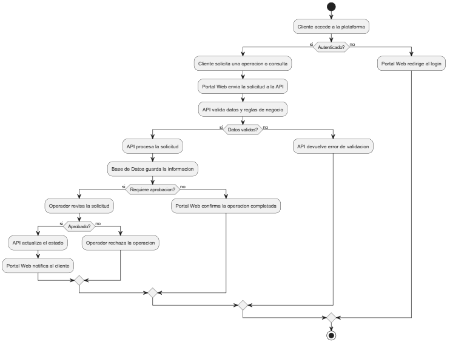

# Visión funcional de RedEfectiva

## Objetivo

Definir el alcance funcional inicial de RedEfectiva para orientar la arquitectura, el comportamiento del sistema y la documentación del proyecto.

## Funcionalidades iniciales

- Acceso a la plataforma por parte del cliente.
- Gestión y supervisión de operaciones por parte del operador.
- Consulta de información desde la aplicación web.
- Procesamiento de solicitudes a través de la API principal.
- Persistencia y auditoría de la información en la base de datos.

## Flujo principal de negocio

El siguiente diagrama describe un flujo genérico de operación dentro de la plataforma, contemplando validación, procesamiento, persistencia y revisión por parte del operador. Este esquema sirve como base para la definición de procesos empresariales más específicos a medida que el dominio del sistema se concrete.

### Diagrama de actividades (versión compatible)

Este entorno de vista previa no carga módulos de lenguaje para PlantUML ni Mermaid, por lo que la opción más segura es dejar el flujo en texto plano con formato ASCII. Así el diagrama sigue siendo legible sin depender de extensiones ni renderers externos.
 

> Nota: esta versión funciona en cualquier visor sin dependencias adicionales y conserva la intención del flujo funcional del sistema.

## Alcance provisional

Este documento debe completarse con los flujos reales de negocio, roles, permisos, validaciones, excepciones y servicios que defina la solución final de RedEfectiva.
